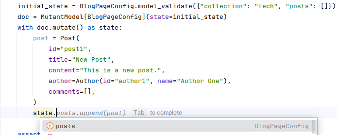

User-friendly tool for combining [pycrdt](https://github.com/jupyter-server/pycrdt) for efficient concurrent content editing and [pydantic](https://docs.pydantic.dev/latest/) for type safety and developer experience.

## Overview

* `pymutantic.mutant.MutantModel` - A type safe `pycrdt.Doc` ⟷ pydantic `pydantic.BaseModel` mapping with granular editing.
* `pymutantic.json_path.JsonPathMutator` - Make edits using json path.
* `pymutantic.migrate.JsonPathMutator` - Granular migration edits between model versions.

## Installation

```bash
pip install pymutantic
```

## Usage

### `MutantModel`

Given a pydantic model...

```python
from pydantic import BaseModel, Field
from typing import List

class Author(BaseModel):
    id: str
    name: str

class Comment(BaseModel):
    id: str
    author: Author
    content: str

class Post(BaseModel):
    id: str
    title: str
    content: str
    author: Author
    comments: List[Comment] = Field(default_factory=list)

class BlogPageConfig(BaseModel):
    collection: str
    posts: List[Post] = Field(default_factory=list)
```

Create pycrdt documents from instances of that model using the `state` constructor parameter:

```python
from pycrdt_utils import MutantModel

# Define the initial state
initial_state = BlogPageConfig(
    collection="tech",
    posts=[
        Post(
            id="post1",
            title="First Post",
            content="This is the first post.",
            author=Author(id="author1", name="Author One"),
            comments=[],
        )
    ]
)

# Create a CRDT document with the initial state
doc = MutantModel[BlogPageConfig](state=initial_state)

print(doc.state)
```

The `state` property will give you an instance of your chosen pydantic model:

```text
BlogPageConfig(
    collection='tech',
    posts=[
        Post(
            id='post1',
            title='First Post',
            content='This is the first post.',
            author=Author(id='author1', name='Author One'),
            comments=[]
        )
    ]
)
```

Make granular edits with the `mutate` function (applied within a transaction):

```python
# Mutate the document
with doc.mutate() as state:
    state.posts[0].comments.append(Comment(
        id="comment1",
        author=Author(id="author2", name="Author Two"),
        content="Nice post!",
    ))
    state.posts[0].title = "First Post (Edited)"

print(doc.state)
```

```
BBlogPageConfig(
    collection='tech',
    posts=[
        Post(
            id='post1',
            title='First Post',
            content='This is the first post.',
            author=Author(id='author1', name='Author One'),
            comments=[
                Comment(
                    id="comment1",
                    author=Author(id="author2", name="Author Two"),
                    content="Nice post!",
                )
            ]
        )
    ]
)
```

As far as your editor and other type aware tooling is concerned, when you call `mutate` the returned `state` object is simply an instance of the pydantic model that you specificied as a type parameter:



The reason why you want to make granular edits is so that these granular edits can be syncronised with other concurrent edits. If we would replace the entire object in the CRDT that would potentially overwrite edits made by other actors. The design philosophy of this library is to always make the smallest edit you can. While CRDTs are powerful tools for synchronising mutliple edits, when two concurrent actors edit the same piece of granular data, one of those edits must win. Therefore we want to keep edits as small as possible to reduce the risk of that happening.

### CRDT update

Get a binary update blob from the CRDT, for example for sending over the wire to other peers:

```python
binary_update_blob: bytes = doc.update
```

Instantiate documents from a binary update blob (or multiple using the `updates` parameter which accepts a list of update blobs):

```python
doc = MutantModel[BlogPageConfig](update=received_binary_update_blob)    
```

Apply another binary update blob, by setting the `update` property:


```python
doc.update = another_received_binary_update_blob
```

### `JsonPathMutator`

There is also a JsonPathMutator class which can be used to make edits to the document using json path:

```python
# Mutate the document
from pycrdt_utils import JsonPathMutator
with doc.mutate() as state:
    mutator = JsonPathMutator(state=state)
    mutator.set("$.posts[0].title", "Updated First Post")

print(doc.state)
```

### `MigrationChain` (experimental)

It is also possible to apply granular schema migration edits using the `MigrationChain` class. By storing multiple versions of a Model and implementing `up` and `down` functions (which in fact are making granular migrations) schema migrations can also be synchronized with other concurrent edits:


```python
class ModelV1(BaseModel):
    schema_version: int = 1
    field: str
    some_field: str

    @classmethod
    def up(cls, state: typing.Any, new_state: typing.Any):
        raise NotImplementedError("can't migrate from null version")

    @classmethod
    def down(cls, state: typing.Any, new_state: typing.Any):
        raise NotImplementedError("can't migrate to null version")


class ModelV2(BaseModel):
    schema_version: int = 2
    some_field: str

    @classmethod
    def up(cls, state: ModelV1, new_state: "ModelV2"):
        del state.field

    @classmethod
    def down(cls, state: "ModelV2", new_state: ModelV1):
        new_state.field = "default"
        
        
from pymutantic.migrate import MigrationChain

migrate = MigrationChain([ModelV1, ModelV2])

doc = MutantModel[ModelV1](state=ModelV1(field="hello", some_field="world"))

# Make an independent edit
doc_copy = MutantModel[ModelV1](update=doc.update)
with doc_copy.mutate() as state:
    state.some_field = "earth"

# Migrate the original document to V5, and apply the independent edit
doc = migrate(doc).to(ModelV2)
doc.update = doc_copy.update
```

```text
ModelV2(schema_version=2, some_field='earth')
```