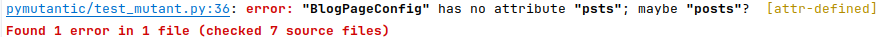

User-friendly tool for combining [pycrdt](https://github.com/jupyter-server/pycrdt) for efficient concurrent content editing and [pydantic](https://docs.pydantic.dev/latest/) for type safety and developer experience.

## Overview

* `pymutantic.mutant.MutantModel` - A type safe `pycrdt.Doc` ⟷ pydantic `pydantic.BaseModel` mapping with granular editing.
* `pymutantic.json_path.JsonPathMutator` - Make edits using json path.
* `pymutantic.migrate.ModelVersionRegistry` - Store a chain of versions for making granular schema migration edits.

### Why do I want this?

The idea behind pymutantic is to provide views over the CRDT in the form of a pydantic model that you specify. There are two types of views:

* **Read only**: Inspect the state of the underlying CRDT with a frozen version of the pydantic model you specify. This model is read only, any changes are not reflected back to the CRDT (TODO: find a way to make this actually mutable)
* **Mutable**: Make granular mutations to the data using a typed and mutable view over the underlying CRDT. Operations on this view are automatically synced with the underlying CRDT. 

## Installation

```bash
pip install pymutantic
```

## Usage

### `MutantModel`

Given a pydantic model...

```python
from pydantic import BaseModel, Field
from typing import List

class Author(BaseModel):
    id: str
    name: str

class Comment(BaseModel):
    id: str
    author: Author
    content: str

class Post(BaseModel):
    id: str
    title: str
    content: str
    author: Author
    comments: List[Comment] = Field(default_factory=list)

class BlogPageConfig(BaseModel):
    collection: str
    posts: List[Post] = Field(default_factory=list)
```

#### Create pycrdt documents from instances of that model using the `state` constructor parameter:

```python
from pycrdt_utils import MutantModel

# Define the initial state
initial_state = BlogPageConfig(
    collection="tech",
    posts=[
        Post(
            id="post1",
            title="First Post",
            content="This is the first post.",
            author=Author(id="author1", name="Author One"),
            comments=[],
        )
    ]
)

# Create a CRDT document with the initial state
doc = MutantModel[BlogPageConfig](state=initial_state)
```

#### Get an immutable view (in the form of an instance of the pydantic model you specified) using the `state` property:

```python
print(doc.state)
```

```text
BlogPageConfig(
    collection='tech',
    posts=[
        Post(
            id='post1',
            title='First Post',
            content='This is the first post.',
            author=Author(id='author1', name='Author One'),
            comments=[]
        )
    ]
)
```

#### Make granular edits with the `mutate` function (applied within a transaction):

```python
# Mutate the document
with doc.mutate() as state:
    state.posts[0].comments.append(Comment(
        id="comment1",
        author=Author(id="author2", name="Author Two"),
        content="Nice post!",
    ))
    state.posts[0].title = "First Post (Edited)"

print(doc.state)
```

```
BlogPageConfig(
    collection='tech',
    posts=[
        Post(
            id='post1',
            title='First Post',
            content='This is the first post.',
            author=Author(id='author1', name='Author One'),
            comments=[
                Comment(
                    id="comment1",
                    author=Author(id="author2", name="Author Two"),
                    content="Nice post!",
                )
            ]
        )
    ]
)
```

#### Type check your code to prevent errors: 

```python
empty_state = BlogPageConfig.model_validate({"collection": "empty", "posts": []})
doc = MutantModel[BlogPageConfig](state=empty_state)
doc.state.psts
```

```bash
$ mypy . --check-untyped-defs --allow-redefinition
```



#### Use your IDE for a comfortable developer experience:


#### Get a binary update blob from the CRDT, for example for sending over the wire to other peers:

```python
binary_update_blob: bytes = doc.update
```

#### Instantiate documents from a binary update blob (or multiple using the `updates` parameter which accepts a list of update blobs):

```python
doc = MutantModel[BlogPageConfig](update=received_binary_update_blob)    
```

#### Apply more binary updates, by setting the `update` property:

```python
doc.update = another_received_binary_update_blob
```

### `JsonPathMutator`

There is also a JsonPathMutator class which can be used to make edits to the document using json path:

```python
# Mutate the document
from pycrdt_utils import JsonPathMutator
with doc.mutate() as state:
    mutator = JsonPathMutator(state=state)
    mutator.set("$.posts[0].title", "Updated First Post")

print(doc.state)
```

### `ModelVersionRegistry` (experimental)

It is also possible to apply granular schema migration edits using the `ModelVersionRegistry` class. By storing multiple versions of a Model and implementing `up` and `down` functions (which in fact are making granular migrations) schema migrations can also be synchronized with other concurrent edits:

```python
class ModelV1(BaseModel):
    schema_version: int = 1
    field: str
    some_field: str

    @classmethod
    def up(cls, state: typing.Any, new_state: typing.Any):
        raise NotImplementedError("can't migrate from null version")

    @classmethod
    def down(cls, state: typing.Any, new_state: typing.Any):
        raise NotImplementedError("can't migrate to null version")


class ModelV2(BaseModel):
    schema_version: int = 2
    some_field: str

    @classmethod
    def up(cls, state: ModelV1, new_state: "ModelV2"):
        del state.field

    @classmethod
    def down(cls, state: "ModelV2", new_state: ModelV1):
        new_state.field = "default"


from pymutantic.migrate import ModelVersionRegistry

migrate = ModelVersionRegistry([ModelV1, ModelV2])

doc = MutantModel[ModelV1](state=ModelV1(field="hello", some_field="world"))

# Make an independent edit
edit = MutantModel[ModelV1](update=doc.update)
with edit.mutate() as state:
    state.some_field = "earth"

# Migrate and apply the independent edit
doc = migrate(doc, to=ModelV2)
doc.update = edit.update
```

```text
ModelV2(schema_version=2, some_field='earth')
```